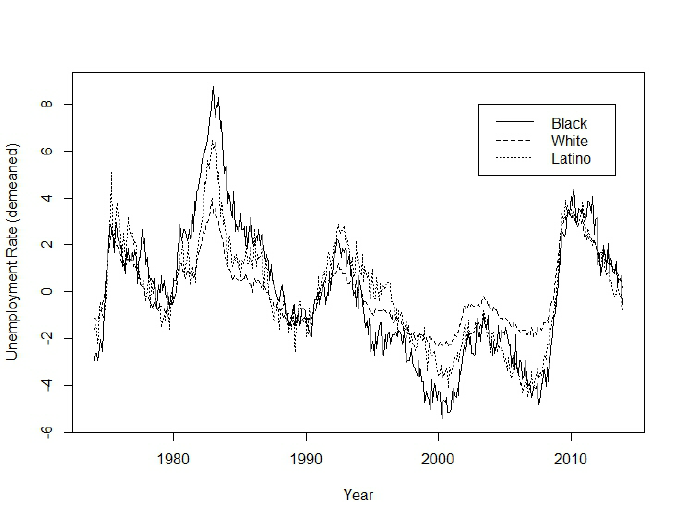
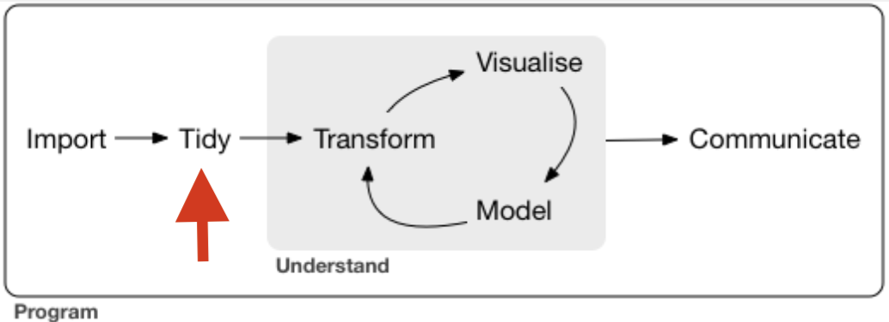
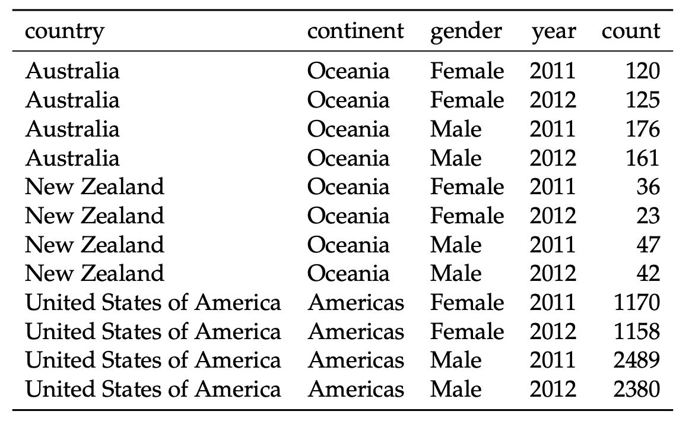

# Presentation structure

 

.pull-left[

### Tidy tools for time-series data

1. Time-Series Data Recap

2. Introduction to the Tsibble Package

3. Introduction to the Fable Package

4. Introduction to the Feasts Package

5. Q&A and Practice

6. Additional resources 
]

.pull-right[

 

]

---

class: inverse, center, middle
name: section

# Time-series data

<html>

</html>

---

# What are time-series data? A little statistics recap!

#### "A time series is defined as a time-ordered sequence of observations taken at regular intervals (e.g., hourly, daily, weekly, monthly, quarterly, annually)." (Kotu and Deshpande, 2019)

#### Main concepts include: 
- *Trends:* refer to the long-term movement or direction in the data, showing an overall upward or downward progression over time.
- *Seasonality:* refers to repeating patterns or fluctuations that occur at regular intervals over time. These patterns are often driven by external, cyclical factors, such as seasons, months, or days of the week, and they tend to recur at the same point in each cycle.
- *Cyclic patterns:* refer to fluctuations that occur over longer periods of time but do not follow a fixed, regular interval like seasonality. These patterns rise and fall due to long-term influences, such as economic cycles, and can vary in both duration and amplitude.

#### Applications and example
Forecasting and trend analysis are some of the most widespread applications of time-series data. Example: monitoring and predicting unemployment rates.

---

# Working with time-series data can be challenging

##### Missing data / Outliers

Missing data or outliers can distort time-series analysis by introducing gaps or extreme values that don't fit the general pattern. 

##### Non-Stationarity

Non-stationarity means that the statistical properties of a time series, like its mean or variance, change over time, making it difficult to predict.

##### Handling multiple time-series

When working with multiple time series it becomes challenging to manage and analyze them simultaneously. Organizing and structuring them properly is key to identifying trends and patterns efficiently across all series.

##### Availability of tidy data

Time-series data is often messy and not ready for analysis, making it harder to apply standard tools (e.g., data format issues).

---

class: inverse, center, middle
name: section

# Tidy tools for time-series: (1) Tsibble package

<html>

</html>

---

# General information on the Tsibble package

.pull-left[
 
#### "The tsibble package provides a data infrastructure for tidy temporal data with wrangling tools. Adapting the tidy data principles, tsibble is a data- and model-oriented object." (Wang, Cook and Hyndman, 2019)
 

Developed by Earo Wang, Di Cook, Rob Hyndman and Mitchell O'Hara-Wild.
 
 
Install and load as usual:  
`install.packages("tsibble")`
  
`library(tsibble)`
]

 

 

---

# Why work with tsibble?

- *Part of Tidyverse*, tsibble aligns with the "tidy" principles of the tidyverse (i.e., every column is a variable, every row is an observation, and every dataset is one table). Allow seamless integration with tidyverse  packages like dplyr, ggplot2, or tidyr.

- Provides a set of tools and functions which make it *easier to prepare time-series data for analysis, visualization and forecasting* (e.g., missing data handling, duplicates check, etc.).

- Facilitates dealing with *multiple and large volumes of time-series data* (using the key and index structure).

---

# The three pillars of tsibble

1. *Index:* Index is a variable representing time ordered from past to present.
2. *Key:*  Single or multiple variables that identify units over time.
3. *Interval:* There are three possible interval types: fixed, unknown, and irregular. Event data
typically involves irregular time intervals (e.g., flight schedules) which can flow into event-based data modeling, but would need to be processed, or regularized, to fit models that expect data with a fixed-time interval -> measurements.

 

##### From these pillars, the four tsibble rules can be derived.

---

# The four tsibble rules (Wang, Cook and Hyndman, 2019)

##### The “tidy data” principles are adapted in tsibble with the following rules:
1. Index is a variable with inherent ordering from past to present. 
2. Key is a set of variables that define observational units over time.
3. Each observation should be uniquely identified by index and key.
4. Each observational unit should be measured at a common interval, if regularly spaced.
 

 

Example given in the paper: The column 'year' represents the index, the columns 'country', 'gender' and 'continent' represent the keys and 'count' is the only measurement.

---

# Tsibble's main verbs

`as_tsibble()` :  Converts data into a "tsibble". "Tsibbles" are the starting point for using the tsibble package. It allows you to specify the index and key.
`my_tsibble <- as_tsibble(data, index = date, key = id)`

`has_gaps()` and `count_gaps()` : Check and counts missing time points.
`my_tsibble %>% count_gaps()`

`fill_gaps()` : Missing values are filled in with NAs.

`index_by()` : Group data by time the index. Similar to dplyr:group_by(). Can be collapsed with summarise().

`group_by_key()` : Groups data by the key. Similar to dplyr:group_by(). Can be collapsed with summarise().

`interval()` : Extracts and verifies the time interval between observations.

`index()` : Extracts the index (time variable) from a tsibble.

---
class: inverse, center, middle
name: section

# Tidy tools for time-series: (2) Fable package

<html>

</html>

---

# General information on the Fable package

 
#### "Fable provides a framework for time series forecasting package in R designed for flexibility, ease and efficiency and works seamlessly with tidy temporal data in the tsibble format. 
 

.pull-left[
Developed by Earo Wang, Di Cook, Rob Hyndman and Mitchell O'Hara-Wild.
 
 
Install and load as usual:  
`install.packages("fable")`
  
`library(fable)`
]

 

---

# Why work with Fable?

### 
- Provides a collection of commonly used *univariate and multivariate time series forecasting models* including exponential smoothing via state space models and automatic ARIMA modelling.

- *Extends with functionalities* of the "forecast" and "tsibble" packages.

- Provides a set of tools to *evaluate, visualise and combine models in a workflow consistent with the tidyverse*.

- *Seamless integration* with tidyverse.

*Practical use cases*: Predict future sales based on historical trends, understand energy usage by time of day or season.

---

#Fable's main verbs 

`fable()`: create a fable, which is a tidy representation of a model.

`ETS()` and `ARIMA()` are the two widely used models.

`model()`: specify and estimate time series forecasting models. Define models such as ARIMA, ETS and others in a tidy framework. This function returns a *mable* (model table). 

`mable`: contains a row for each time series (uniquely identified by the key variables) and a column for each model specification.

`glance()`: provides a quick, high level summary of model performance and provides concise overview of the key metrics and diagnostics of the model. 

`report()`: provides detail summary of the model's components and estimates (when working with one specific model).

`autoplot()`: to see historical data along with the forecasts.

`components()`: extract and view different components (trend, seasonal, etc) of a time series model.
---

class: inverse, center, middle
name: section

# Tidy tools for time-series: (3) Feasts package

<html>

</html>

---

# General information on the Feasts package

 
#### "The feasts (Feature Extraction and Statistics for Time Series) package provides for collection of features, decomposition methods, statistical summaries and graphics functions for analysing tidy time series data." 
 

.pull-left[
Developed by Earo Wang, Di Cook, Rob Hyndman, Mitchell O'Hara-Wild, Thiyanga Talagala, and Leanne Chhay.
 
 
Install and load as usual:  
`install.packages("feasts")`
  
`library(feasts)`
]

 

---

# Why work with Feasts

- *Works alongside the tsibble and fable packages* to provides a comprehensive framework for time series exploration.

- *Decomposition of time series* into components (trend, seasonality, etc).

- *Extraction* of useful statistical features.

- *Provides for visual tools* for summarizing and analyzing time series behaviour.

*Practical use cases*: analyse the underlying components of time series, such as trends and seasonality, for better insights.
---

# Feasts main verbs

`STL()`: Decomposes time series into seasonal, trend, and remainder components, helps visualise and analyse the underlying patterns in the data.

`feast_acf()`: Extracts autocorrelation features from time series to identify relationships between time lags.

`ACF()`: Plots autocorrelation function of a time series and helps visualise the correlation between a time series and time lags.

`feasts()`: A wrapper function that extracts a large number of features from the time series in a single step. Quick way to get a comprehensive feature set for model building or analysis.

---

# Integration of Tidy Tools: Tsibble, Fable and Feasts

#### "These tools create a seamless workflow for time series analysis, from data preparation (tsibble), to forecasting (fable), and feature extraction (feasts) in a tidyverse-friendly manner"

`Tsibble`:
- Provides a tidy framework for *organizing time series data*.
- It ensures data is indexed and stored with proper time-based structure, making it easy to manipulate, filter and visualize.

`Fable`:
- Builds on Tsibble by offering *time series forecasting models*. 
- It allows to model, estimate, and forecast future values in a consistent, tidy framework.

`Feasts`:
- Complements Fable by enabling *feature extraction and decomposition*.
- Analyse trends, seasonality, and auto correlations to improve forecasting models.
---

class: inverse, center, middle
name: section

# Q&A and Practice

<html>

</html>

---

# References

##### Literature: 
Kotu, V., & Deshpande, B. (2019). Time series forecasting. Data science, 2, 395-445.

Wang, E., Cook, D. and Hyndman, R. (2019). A new tidy data structure to support exploration and modeling of temporal data A new tidy data structure to support exploration and modeling of temporal data. [online] Available at: https://pdf.earo.me/tsibble.pdf [Accessed 22 Oct. 2024].

##### Images:
https://www.researchgate.net/profile/Tucker-Mcelroy/publication/263237920/figure/fig3/AS:2965350918922261447710883280/Time-series-plot-of-the-three-unemployment-rate-series-Each-series-is-demeaned-with.png

https://mitchelloharawild.com/blog/feasts/feasts.png

https://slides.earo.me/phd19/img/tsibble.png

https://d33wubrfki0l68.cloudfront.net/795c039ba2520455d833b4034befc8cf360a70ba/558a5/diagrams/data-science-explore.png 

---

# Additional resources 

##### On Tsibbles:
[Research paper: A new tidy data structure to
support exploration and modeling
of temporal data](https://www.tandfonline.com/doi/full/10.1080/10618600.2019.1695624)

[Tsibble Main Page](https://tsibble.tidyverts.org/)

[Tsibble presentation - R Consortium](https://www.youtube.com/watch?v=v6yRmbulxUM&t=404s)

[Tsibble RDocumentation](https://search.r-project.org/CRAN/refmans/tsibble/html/tsibble-package.html)

##### On Fable:

[Fable Main Page](https://fable.tidyverts.org/)

[Fable RDocumentation](https://cran.r-project.org/web/packages/fable/vignettes/fable.html)

[Introducing Fable - Forescasting models for tidy time series](https://mitchelloharawild.com/blog/fable/)

[Why R? 2021 | Forecasting | Feasts & fables: modern tools for time series analysis](https://www.youtube.com/live/v2QIuB-TjZo)

---

# Additional resources 

##### On Feasts:

[Feasts Main Page](https://feasts.tidyverts.org/)

[Feasts RDocumentation](https://cran.r-project.org/web/packages/feasts/readme/README.html)

[Why R?Foundaiton : Presentation on Forecasting: Feasts and Fables by Rob Hyndman](https://www.youtube.com/live/v2QIuB-TjZo)
